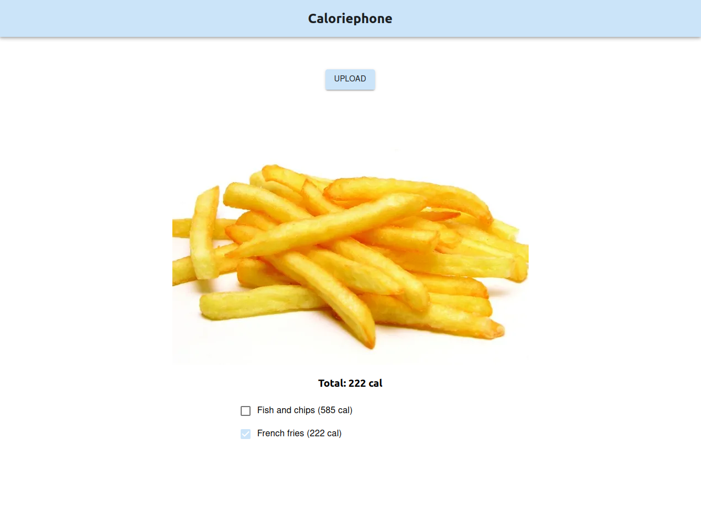
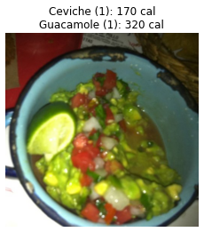

# CaloriePhone: food-to-calorie translation

Team 509, Final Deep Learning Project, College of Management Academic Studies

***

Track your calorie intake with a simple photo! Caloriephone lets you take a single picture of your meal and then uses deep learning magic to calculate the amount of calories you are about to eat. The motivation is to make life easier for those who work out or are on a diet.

  

Behind the scenes, this is a multi-class multi-label deep learning model which uses transfer learning and various machine learning techniques to classify foods depicted in a given image. This data is then used to translate the foods to their calorie amount and sum it all up to return the amount of calories present in a given image.

  

